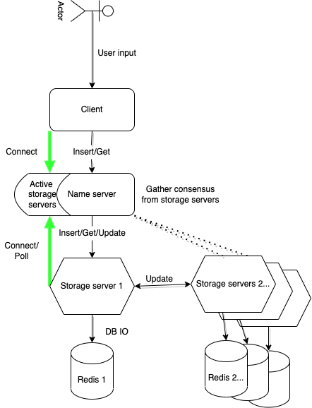

# Introduction

This is a simple python-based implementation of a distributed storage

# How to launch the system?

The easiest way to launch is using docker-compose. In the project directory run

```
docker-compose up
```

To launch all services. Then in another terminal connect to the client with

```
docker attach <client container name>
```

The container names should be `<directory_name>_<service>_1`, for example for me the client container is `distributed-store_client_1`.

Project can be also run without docker by running the services manually with `python3`. This requires that the following dependencies are installed:

**For client**: Python3 with rpyc, prompt-toolkit, prompt.

**For NameServer**: Python3 with rpyc

**For StorageServers**: Python3 with rpyc and redis

Then the services can be manually started (nameserver first). The services need to know where each other are via command line arguments. No reason to do this, just use the docker-compose scripts instead.

# How to use it?

Once you run the script and are attached to the client. Type `help` for help, but the commands are very simple and self evident:

```
insert <key> <value>
```

```
get <key>
```

For an inside look, type `dump` to see the keys of all stores.

# Architecture



Project consists of four different services: **client**, **nameserver**, **storageserver** and **redis**. Client has the user interface, and communicates with nameserver. Nameserver is the orchestrator between the client and the (possibly) multiple storageservers. Storageservers handle the storing each using their personal redis instance. Communication betewen the services is done entirely by remote procedure calls, there is no shared memory or other communication avenue.

The idea is that the nameserver is a known entity to which clients and storageservers can connect at will. I did the choice to have it static instead of having some election process just for simplicity. The distribution is focused entirely on the storageservers and the replicated data store they access.

The connections between the client and the nameserver is established at startup. Likewise the storageservers connect to the nameserver at startup, and then keep periodically polling the nameserver to announce that they are still alive. The nameserver maintains a list of alive storageservers in memory. At the moment there is no persistency on the nameserver side, and it has no memory of storageservers that it is no longer connected to.

# Communication Protocols - RPyC

RPyC is a popular Python library used for remote procedure calls. All communications between Naming Server, Storage Servers, and the Client in our application is done using RPyC as it is simple to use and allows us to call remote methods and attributes in a local context. There is no real practical reason for choosing this other than it being relatively simple to use. The real-world practicality or performance was not of concern, it is just taking care of communication between nodes. Thse specifics of the messaging protocol is not important for the overall architecture, as long as it's message-based.

# Backlog

Smaller stuff that I will hopefully be able to implement

- Return ok from set/del etc. operations after all stores have signed off on it
- list all connected services and some data about them

# Planned features

These are features that I would like to have, and might add if there is time. Not all are feasible, as this is a solo hobbled-together project. Ordered somewhat in usefulness or interest with regards to the distributed nature of the project.

- consistency check for store operations
- two(or three)-phase commit
- (Background) task keeping stores consistant
- Persistent logging from services
- Make all (server-side) nodes identical, and implement some election in case leader fails
- Better/more storage options
- Make setup to run on VMs or separate physical machines
- If ever achieve many of these, then have option to toggle between modes and kill/spawn nodes at will
- Client to reconnect to nameserver, and in general be more resilient and not crash easily
